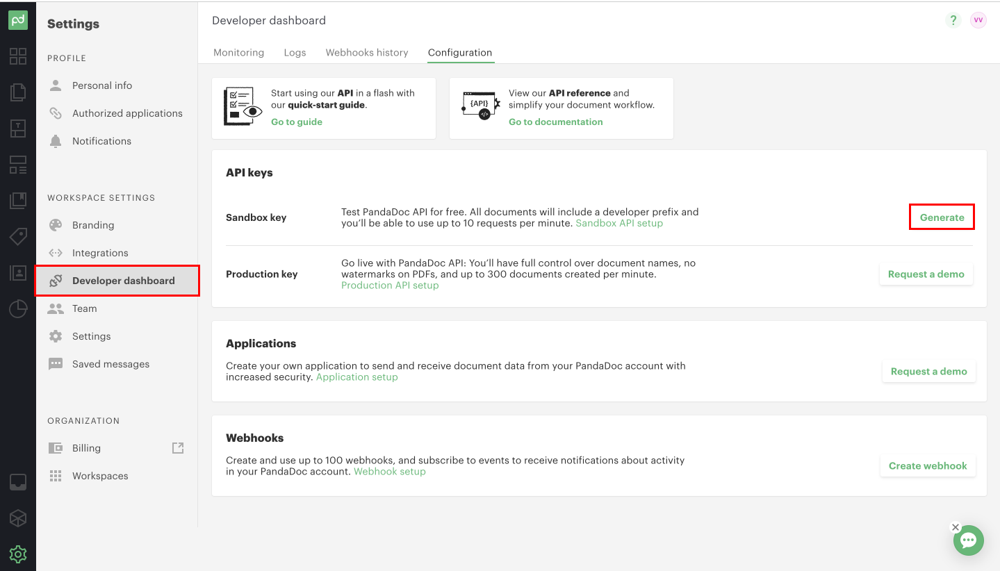
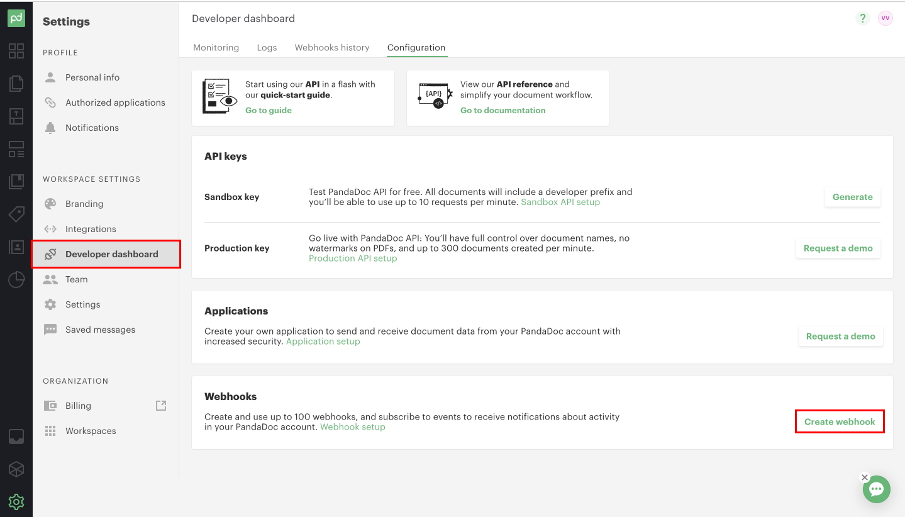
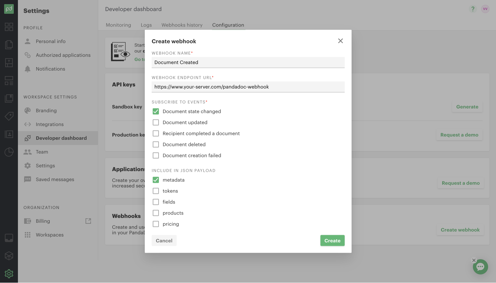
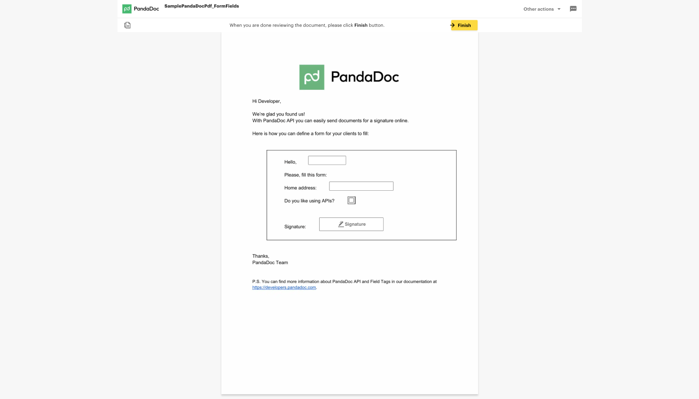

# Creating & Sending Documents Using Python

Every year StackOverflow asks its audience what programming languages they use in their work. In recent years, Python has edged closer to 50% of respondents, second only to JavaScript amongst pure programming languages. And there's a good reason: it's incredibly useful at automating tasks.

In this post, we'll use Python to create and send PDF documents. Even better, you'll be able to embed legal signatures into these documents using PandaDoc.

We'll take you through this example one code snippet at a time. If you prefer, you can grab [all the code](https://github.com/PandaDoc/pandadoc-api-python-client/blob/main/examples/create_from_pdf_by_url_and_send.py) and follow along.

## Setting up the PandaDoc Python SDK

In order to start creating and sending PDF documents with Python, we will first need to install the PandaDoc client for python.

To get started with using the PandaDoc python client, install the python package with pip:

```python
pip3 install pandadoc-python-client
```

You may need to run pip with root permissions:

```python
sudo pip3 install pandadoc-python-client
```

Once you have installed the PandaDoc client, you can import it into your codebase:

```python
import pandadoc_client
```

### Configuring Your API Key and Verifying Set Up

To create an API Key, log into your PandaDoc account and go to the Developer Dashboard section. If you haven't created an account yet, you can do so [here](https://signup.pandadoc.com/?ss=api-dev&plan=rec_plans_v4_enterprise_an&lng=en-US):



Afterwards, you can generate a sandbox key and copy it for later use.

To verify that you have set up the PandaDoc Python client and API Key correctly, create a new python script called **pandadoc.py** and paste in the following code with your API Key. Next, run the python script with _python3 pandadoc.py_ and verify that it runs successfully.

Don't worry about what the code does for now, we are just testing if the client is installed correctly.

```python
# Configure API key authorization: apiKey
api_key = "YOUR_API_KEY"

# Defining the host is optional and defaults to https://api.pandadoc.com
# See configuration.py for a list of all supported configuration parameters.
cfg = pandadoc_client.Configuration(
    host="https://api.pandadoc.com",
    api_key={"apiKey": f"API-Key {api_key}"},
)

# Enter a context with an instance of the API client
with pandadoc_client.ApiClient(cfg) as api_client:
    # Create an instance of the API class
    try:
        api_instance = templates_api.TemplatesApi(api_client)
        
        resp = api_instance.list_templates(tag=["doe-inc-proposals"])
        print(resp)

    except pandadoc_client.ApiException as e:
        print("Exception when calling TemplatesApi->list_templates: %s\n" % e)
 ```

If you have set up the client correctly, you should see the following output in your terminal.

```
{
  "results": []
}
 ```
 
## Creating and Sending Documents with the Python SDK

With the PandaDoc API, you can create a document from a file or by using a template. In this tutorial we will demonstrate how to create a document from a file url.

Here are two sample file URLs for you to test the endpoint with:

- [Sample PDF with Form Fields](https://cdn2.hubspot.net/hubfs/2127247/public-templates/SamplePandaDocPdf_FormFields.pdf)
- [Sample PDF with Field Tags](https://cdn2.hubspot.net/hubfs/2127247/public-templates/SamplePandaDocPdf_FieldTags.pdf)

To create a document from a file, modify the code that we pasted into the **pandadoc.py** file we created earlier with the following:
```python
from time import sleep

import pandadoc_client
from pandadoc_client.model.document_create_request_recipients import DocumentCreateRequestRecipients
from pandadoc_client import ApiClient, Configuration
from pandadoc_client.api import documents_api
from pandadoc_client.model.document_create_request import DocumentCreateRequest


# place your api key here
API_KEY = '7bca3427875108e9bef10d3683e646269dc7a0e1'
DOCUMENT_PDF_URL = 'https://cdn2.hubspot.net/hubfs/2127247/public-templates/SamplePandaDocPdf_FieldTags.pdf'
MAX_CHECK_RETRIES = 5


def create_document_from_sample_template_pdf_url(api_instance):
   document_create_request = DocumentCreateRequest(
       name='Sample Document from PDF with Field Tags',
       url=DOCUMENT_PDF_URL,
       tags=[
           'tag_1',
           'tag_2',
       ],
       recipients=[
           DocumentCreateRequestRecipients(
               email='josh@example.com',
               first_name='Josh',
               last_name='Ron',
               role='user',
               signing_order=1,
           ),
           DocumentCreateRequestRecipients(
               email='john@example.com',
               first_name='John',
               last_name='Doe',
               signing_order=2,
           ),
       ],
       fields={
           'name': {'value': 'John', 'role': 'user'},
           'like': {'value': True, 'role': 'user'},
       },
       metadata={'salesforce.opportunity_id': '123456', 'my_favorite_pet': 'Panda'},
       parse_form_fields=False,
   )

   return api_instance.create_document(document_create_request=document_create_request)

def main():
   cfg = Configuration(api_key={'apiKey': f'API-Key {API_KEY}'})
   # Enter a context with an instance of the API client
   with ApiClient(cfg) as client:
       try:
           api_instance = documents_api.DocumentsApi(client)
           document = create_document_from_sample_template_pdf_url(api_instance)
           print(f'Document was successfully uploaded:\n{document}')
           # ensure_document_created(api_instance, document)
           # send_document_created(api_instance, document)
           # print(f'Document was successfully created and sent to the recipients!')

       except pandadoc_client.ApiException as e:
           print(f'{e.status} {e.reason} {e.body}')


if __name__ == '__main__':
   main()
 ```
 
If you run the **pandadoc.py** script with `python3 pandadoc.py` you should see the following output if it worked successfully:

Document was successfully uploaded:
```
{
  "date_created": "20XX-XX-XXXX",
  "date_modified": "20XX-XX-XXXX",
  "expiration_date": null,
  "id": "abcdefgh1234567890",
  "info_message": "You need to poll the Document Status method until the status will be changed to document.draft",
  "links": [
    {
      "href": "https://api.pandadoc.com/public/v1/documents/abcdefgh1234567890",
      "rel": "status",
      "type": "GET"
    }
  ],
  "name": "[DEV] Sample Document from PDF with Field Tags",
  "status": "document.uploaded",
  "uuid": "abcdefgh1234567890",
  "version": null
}
 ```

In this code sample, we are creating a new document using the **api_instance.create_document** endpoint. We are passing in an object that we create using the **DocumentCreateRequest** method that we imported. This method takes in the following fields:

- name
- url
- tags
- recipients
- fields
- metadata
- parse_form_fields

The _url_ field is the URL of the pdf file we are using.The _recipients_ field takes in an array of recipient objects. We can use the **DocumentCreateRequestRecipients** method that we imported to create these objects as shown in the code sample.

We are storing the result of the **create_document_from_sample_template_pdf_url** into the _document_ variable which we will use later to eventually check on the document status and send the document.

### Getting documents status with the status\_document endpoint

Since the create\_document endpoint is asynchronous, we need to check that it was actually completed successfully before we send the document.

To do so we can create the following method in **pandadoc.py** that checks the status of the document with the **status\_document** endpoint:

```python
def ensure_document_created(api_instance, document):
   # Document creation is non-blocking (asynchronous) operation.
   #
   # With a successful request, you receive a response with the created
   # document's ID and status document.uploaded.
   # After processing completes on our servers, usually a few seconds,
   # the document moves to the document.draft status.
   # Please wait for the webhook call or check this document's
   # status before proceeding.
   #
   # The change of status from document.uploaded to another status signifies
   # the document is ready for further processing.
   # Attempting to use a newly created document before PandaDoc servers
   # process it will result in a '404 document not found' response.

   retries = 0
   while retries < MAX_CHECK_RETRIES:
       sleep(2)
       retries += 1

       doc_status = api_instance.status_document(document['id'])
       if doc_status.status == 'document.draft':
           return

   raise RuntimeError('Document was not sent')
```

Afterwards, we can uncomment the **ensure\_document\_created** method in the main() method of **pandadoc.py**.

Try running the **pandadoc.py** file again with `python3 pandadoc.py`.

If your document was never created, you should see 'Document was not set' in your terminal. Otherwise, your document should have been successfully created.

### Sending Documents with the Python SDK

Now that we've verified that our document was created, we can now send the document to our recipients. To do this, add the **send\_document** method to the **pandadoc.py** file. Be sure to also uncomment the **send\_document** method call and print statement in the main method.

```python
def send_document(api_instance, document):
   api_instance.send_document(
       document['id'],
       document_send_request=DocumentSendRequest(
           silent=False, subject='This doc was send via python SDK'
       ),
   )
```

Try running the **pandadoc.py** file again with _python3__pandadoc.py_. If it is successful you should see the following output to your terminal:

"Document was successfully created and sent to recipients!"

## Setting up Webhooks to Handle Documents

In our demo example, we are polling to see if the document's status has changed to _'document.draft'_ and after five attempts we throw an error message. In a production environment, this isn't a good way to check if a document was successfully created.

Instead, we recommend setting up a webhook to listen to changes in your document status and to then handle the document accordingly once the status changes.

You can create a webhook by going to your PandaDoc dashboard and selecting Create Webhook at the very bottom.



Afterwards, you can subscribe to Document State Changed events and include metadata.



### Handling the webhook payload in your webhook endpoint

You will need to also provide a webhook endpoint URL which should be hosted on your own server. The endpoint should receive a payload whenever a document changes status and should handle the payload accordingly.

Webhook data is in the form of an array and may contain a few notification objects at the same time. Basic information and **recipient** are always returned. **fields** , **tokens**, **products**, and **pricing** can be configured in webhook settings.

Additionally, to make sure requests are valid and not spoofed, you can provide webhook verification by providing your own shared key and signature.

For more information about webhook events or webhook verification, [read the webook documentation here](https://developers.pandadoc.com/reference/on-document-status-change#webhooks-verification).

## Sharing Documents with the Python SDK

### Creating a Document Link

We will often want to create a link that we can send to our recipients containing our document. This way we can embed the link in an email or an internal page so that our recipients can click on it.

To create a document link in Python, we will need to call the **create\_document\_link** method and provide the document id as well as a **DocumentCreateLinkRequest** object. The **DocumentCreateLinkRequest** object will include recipient emails as well as a duration for how long the link will be active.

```python
import pandadoc_client
from pandadoc_client.api import documents_api
from pandadoc_client.model.document_create_link_response import DocumentCreateLinkResponse
from pandadoc_client.model.document_create_link_request import DocumentCreateLinkRequest

configuration = pandadoc_client.Configuration(
    host="https://api.pandadoc.com",
)

configuration.api_key['apiKey'] = 'YOUR_API_KEY'
configuration.api_key_prefix['apiKey'] = 'API-Key'

# Enter a context with an instance of the API client
with pandadoc_client.ApiClient(configuration) as api_client:
    # Create an instance of the API class
    api_instance = documents_api.DocumentsApi(api_client)
    id = "ZPeAfcpzr9aiVs5vqUf6jg"  # str | Document ID
    document_create_link_request = DocumentCreateLinkRequest(
        recipient="josh@example.com",
        lifetime=900,
    )  # DocumentCreateLinkRequest 
    try:
        # Create a Document Link
        api_response = api_instance.create_document_link(id, document_create_link_request)
        print(api_response)
    except pandadoc_client.ApiException as e:
        print("Exception when calling DocumentsApi->create_document_link: %s\n" % e)
```

To learn more about creating a link, check out the [API documentation](https://developers.pandadoc.com/reference/link-to-a-document) and the [Github examples](https://github.com/PandaDoc/pandadoc-api-python-client/blob/main/docs/DocumentsApi.md#create_document_link).

### Creating a view session

If you want to embed your document link in an iframe so that you can have it on your own webpage, you can do so with a view session.

To create an iframe with your document link embedded, copy the following code using your document link in the url:

```html
<iframe src="https://app.pandadoc.com/s/{id]"></iframe>
```



To learn more about creating a view session, check out the [API Documentation](https://developers.pandadoc.com/reference/embed-a-document).

### Linking a new document to your CRM

If you want to link your new document to your CRM of choice, you can also do it with the Python SDK.

To create a linked document, we will need to call the **create\_linked\_object** method and pass in the document id, and a **LinkedObjectCreateRequest** object. The **LinkedObjectCreateRequest** object will include the CRM provider, entity type, and entity id.

```python
import pandadoc_client
from pandadoc_client.api import documents_api
from pandadoc_client.model.linked_object_create_response import LinkedObjectCreateResponse
from pandadoc_client.model.linked_object_create_request import LinkedObjectCreateRequest

configuration = pandadoc_client.Configuration(
    host="https://api.pandadoc.com",
)

# Configure API key authorization: apiKey
configuration.api_key['apiKey'] = 'YOUR_API_KEY'
configuration.api_key_prefix['apiKey'] = 'API-Key'

# Enter a context with an instance of the API client
with pandadoc_client.ApiClient(configuration) as api_client:
    # Create an instance of the API class
    api_instance = documents_api.DocumentsApi(api_client)
    id = "ZPeAfcpzr9aiVs5vqUf6jg"  # str | Specify document ID.
    linked_object_create_request = LinkedObjectCreateRequest(
        provider="pipedrive",
        entity_type="deal",
        entity_id="9372",
    )  # LinkedObjectCreateRequest 

    # example passing only required values which don't have defaults set
    try:
        # Create Linked Object
        api_response = api_instance.create_linked_object(id, linked_object_create_request)
        print(api_response)
    except pandadoc_client.ApiException as e:
        print("Exception when calling DocumentsApi->create_linked_object: %s\n" % e)
```

To learn more about linking documents to CRMs, check out the [API Documentation](https://developers.pandadoc.com/reference/link-to-crm-2) or the [Github examples](https://github.com/PandaDoc/pandadoc-api-python-client/blob/main/docs/DocumentsApi.md#create_linked_object).